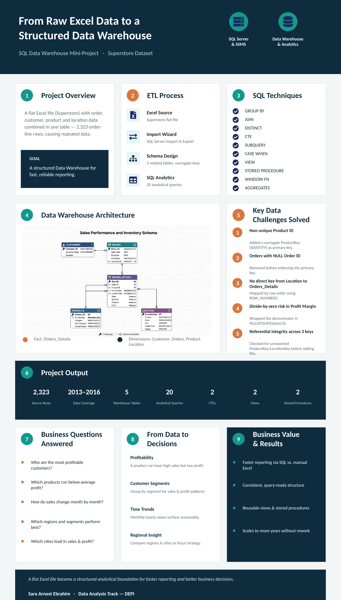

# Superstore Sales Analysis — SQL Server

📌 Overview

This project is a SQL Server data analysis project built using Superstore sales data.

The main goal of the project was to transform raw Excel data into a structured relational database, establish relationships between the different entities, and use SQL to analyze sales, profit, customers, products, shipping, and regional performance.

The project covers the complete workflow from data preparation and database design to analysis and business insights.

It includes:

Building and structuring relational tables
Defining Primary Keys and Foreign Keys
Handling data-quality and key-uniqueness issues
Using SQL joins and aggregations for analysis
Applying subqueries and CTEs for more advanced questions
Creating KPI reports
Building reusable Views
Creating parameterized Stored Procedures
Extracting business insights from the results

The final analysis contains 2,323 order-detail records, 1,175 orders, and 629 customers, with total sales of 501,239.75 and total profit of 39,706.21, resulting in a 7.92% profit margin.

## 📑 Table of Contents
- [📌 Overview](#superstore-sales-analysis--sql-server)
- [🎯 Business Focus](#-business-focus)
- [📊 Project Highlights](#-project-highlights)
- [🗂️ Database Design](#%EF%B8%8F-database-design)
- [📁 Database Tables](#-database-tables)
- [🔄 Data Preparation & Modeling](#-data-preparation--modeling)
- [✅ Data Validation](#-data-validation)
- [🔍 Business Analysis](#-business-analysis)
- [📈 Key Results & Insights](#-key-results--insights)
- [🧠 Advanced SQL](#-advanced-sql)
- [👁️ Views](#%EF%B8%8F-views)
- [⚙️ Stored Procedures](#%EF%B8%8F-stored-procedures)
- [🛠️ SQL Skills Demonstrated](#%EF%B8%8F-sql-skills-demonstrated)
- [📂 Repository Structure](#-repository-structure)
- [⚠️ Data Modeling Considerations](#%EF%B8%8F-data-modeling-considerations)
- [🎯 Project Takeaways](#-project-takeaways)
- [👩‍💻 About](#-about)
  

🎯 Business Focus

The analysis was designed to answer questions such as:

Which customer segments generate the most sales and profit?
Which products and categories are the most profitable?
How do discounts relate to profitability?
Which shipping methods are most frequently used?
How does sales and profit performance change over time?
Which cities and regions perform best?
Which customers contribute the most profit?

The project focuses not only on what the numbers say, but also on identifying patterns and insights that can support better business understanding and decision-making.
---

## 📊 Project Highlights

This project combines **database design, data transformation, SQL analysis, KPI reporting, and business insights** in one workflow.



### Key Results

| KPI | Value |
|---|---:|
| Total Sales | 501,239.75 |
| Total Profit | 39,706.21 |
| Profit Margin | 7.92% |
| Total Orders | 1,175 |
| Total Customers | 629 |
| Total Quantity | 8,780 |

### Main Insights

- **Consumer** generated the highest total sales.
- **Corporate** generated the highest total profit.
- **Technology** was the strongest product category by both sales and profit.
- **Furniture** generated substantial sales but resulted in an overall loss.
- **2015** achieved the highest annual profit.
- **Houston** had the highest sales among the analyzed cities.
- **Austin** had the highest profit among the analyzed cities.
- Higher discount levels were associated with substantial negative profit in the analyzed data.

---

## 🗂️ Database Design

The raw Excel source was transformed into a relational SQL Server database containing five main tables:

```text
Customers
    │
    └── Orders
           │
           └── Orders_Details
                  ├── Products
                  └── Location
```

### ERD


### Main Relationships

- `Customers → Orders`
- `Orders → Orders_Details`
- `Products → Orders_Details`
- `Location → Orders_Details`

The database uses **primary keys and foreign keys** to maintain relationships and data integrity.

---

## 📁 Database Tables

### Customers

Stores customer information.

| Column | Description |
|---|---|
| Customer ID | Primary Key |
| Customer Name | Customer name |
| Segment | Customer segment |

### Orders

Stores order-level information.

| Column | Description |
|---|---|
| Order ID | Primary Key |
| Order Date | Order date |
| Ship Date | Shipping date |
| Ship Mode | Shipping method |
| Customer ID | Foreign Key |

### Products

Stores product information.

| Column | Description |
|---|---|
| ProductKey | Primary Key |
| Product ID | Source product identifier |
| Category | Product category |
| Sub-Category | Product sub-category |
| Product Name | Product name |

### Orders_Details

Stores transaction-level sales information.

| Column | Description |
|---|---|
| Row ID | Primary Key |
| Order ID | Foreign Key |
| Product ID | Source product identifier |
| ProductKey | Foreign Key |
| Sales | Sales amount |
| Quantity | Quantity sold |
| Discount | Discount rate |
| Profit | Profit amount |
| LocationKey | Foreign Key |

### Location

Stores geographic information.

| Column | Description |
|---|---|
| LocationKey | Primary Key |
| Country | Country |
| City | City |
| State | State |
| Postal Code | Postal code |
| Region | Region |

---

## 🔄 Data Preparation & Modeling

The project started from raw Excel source tables and transformed them into structured SQL Server tables.

### Customer Data

The customer data was transformed into a dedicated `Customers` table, with `Customer ID` defined as the primary key.

### Product Data

The source `Product ID` was not unique, so it could not safely be used as the primary key.

A surrogate key called `ProductKey` was created using:

```sql
ALTER TABLE Products
ADD ProductKey INT IDENTITY(1,1);
```

`ProductKey` was then used as the primary key and as the foreign key in `Orders_Details`.

### Order Data

Order-level records were extracted using `SELECT DISTINCT`.

Rows with a null `Order ID` were removed before defining the primary key.

### Location Data

A surrogate `LocationKey` was created for the `Location` table.

Because the source location data did not contain a direct business key connecting each location to an individual order-detail row, a temporary row-number mapping mechanism was used during the transformation.

The resulting relationship was then validated to ensure that every order-detail row received a location.

---

## ✅ Data Validation

After creating the relationships, the database was validated using SQL queries.

| Validation Metric | Result |
|---|---:|
| Total Order Details | 2,323 |
| Rows With Product | 2,323 |
| Rows With Location | 2,323 |

All **2,323 order-detail rows** were successfully linked to both a product and a location.

---

## 🔍 Business Analysis

The project contains SQL analysis covering several business areas.

### Customer Analysis

- Customers by segment
- Orders by segment and shipping mode
- Top 10 customers by profit
- Sales and profit by segment
- Customers above average sales

### Shipping Analysis

- Average shipping time by ship mode
- Average shipping time by year
- Orders, sales, and profit by ship mode

### Sales & Profit Analysis

- Sales and profit by product category
- Sales and profit by sub-category
- Sales and profit by discount
- Monthly sales and profit
- Yearly sales and profit

### Product Analysis

- Products below average profit
- Highest-profit product in each category

### Advanced Analysis

- Top customer by total sales in each segment
- Monthly sales compared with the average monthly sales of the same year

### KPI & Regional Analysis

- Total sales
- Total profit
- Total orders
- Total customers
- Total quantity
- Profit margin
- Regional performance
- City performance

---

## 📈 Key Results & Insights

### Overall Performance

| Metric | Result |
|---|---:|
| Total Sales | 501,239.75 |
| Total Profit | 39,706.21 |
| Profit Margin | 7.92% |
| Total Orders | 1,175 |
| Total Customers | 629 |
| Total Quantity | 8,780 |

The dataset generated approximately **501.2K in sales** and **39.7K in profit**, resulting in an overall profit margin of **7.92%**.

---

### Customer Segment Performance

| Segment | Sales | Profit |
|---|---:|---:|
| Consumer | 252,031.38 | 8,563.97 |
| Corporate | 157,995.75 | 18,703.82 |
| Home Office | 91,212.62 | 12,438.42 |

**Insight:** Consumer generated the highest sales, while Corporate generated the highest profit.

This shows why analyzing revenue alone is not enough to understand business performance.

---

### Category Performance

| Category | Sales | Profit |
|---|---:|---:|
| Technology | 170,416.29 | 33,697.52 |
| Office Supplies | 167,026.32 | 8,879.78 |
| Furniture | 163,797.14 | -2,871.09 |

**Insight:** Technology was the strongest category by both sales and profit.

Furniture generated significant sales but ended with a negative total profit, making it an important area for further investigation.

---

### Shipping Performance

| Ship Mode | Avg. Shipping Days | Orders |
|---|---:|---:|
| Same Day | 0 | 62 |
| First Class | 2 | 174 |
| Second Class | 3 | 224 |
| Standard Class | 4 | 715 |

**Insight:** Standard Class was the most frequently used shipping method, with 715 orders.

---

### Yearly Performance

| Year | Sales | Profit |
|---|---:|---:|
| 2013 | 103,838.12 | 539.54 |
| 2014 | 102,874.22 | 11,716.73 |
| 2015 | 147,429.40 | 19,899.10 |
| 2016 | 147,098.01 | 7,550.84 |

**Insight:** 2015 achieved the highest annual profit at **19,899.10**.

---

### Discount Analysis

Higher discount levels showed substantial negative profit in the analyzed data.

One notable example:

| Discount | Sales | Profit |
|---:|---:|---:|
| 0.80 | 16,963.68 | -30,539.09 |

This does not by itself prove that discounts caused the losses, but it identifies high-discount transactions as an important area for further investigation.

---

### Monthly Performance

The monthly analysis identified:

- **September** as the highest month by sales: **76,855.42**
- **October** as the highest month by profit: **12,644.29**
- **February** and **July** as loss-making months in the combined monthly analysis

This helps highlight seasonal differences between sales volume and profitability.

---

### City Performance

- **Houston** — highest sales: **80,629.77**
- **Austin** — highest profit: **8,496.00**

The difference between the highest-sales city and highest-profit city reinforces the importance of analyzing **sales and profit separately**.

---

## 🧠 Advanced SQL

The project uses several advanced SQL concepts to answer more complex business questions.

### CTE Analysis

Two CTE-based analyses were created:

1. **Top Customer by Total Sales in Each Segment**
2. **Monthly Sales Compared with the Average Monthly Sales of the Same Year**

Example structure:

```sql
WITH TotalCustomer AS
(
    ...
),
MaxCustomer AS
(
    ...
)
SELECT ...
```

These queries demonstrate how CTEs can make multi-step analytical logic easier to organize.

---

## 👁️ Views

Two reusable views were created.

### `vw_Monthly_Sales_Performance`

Provides:

- Order year
- Order month
- Total sales
- Total profit
- Total orders
- Profit margin

### `vw_Customer_Performance`

Provides:

- Customer
- Segment
- Order count
- Total sales
- Total profit
- Average order value

These views make frequently used analysis easier to access without rewriting the complete query.

---

## ⚙️ Stored Procedures

Two parameterized stored procedures were created.

### `sp_Sales_By_Date_Range`

Returns:

- Total sales
- Total profit
- Total orders
- Profit margin

Example:

```sql
EXEC sp_Sales_By_Date_Range
    @StartDate = '2016-01-01',
    @EndDate = '2016-12-31';
```

### `sp_Regional_Performance`

Accepts a region and returns:

- Total sales
- Total profit
- Total orders

Example:

```sql
EXEC sp_Regional_Performance
    @Region = 'Central';
```

---

## 🛠️ SQL Skills Demonstrated

- SQL Server / SSMS
- Relational database design
- Data transformation
- Data cleaning and validation
- Primary Keys
- Foreign Keys
- Surrogate Keys
- `SELECT INTO`
- `ALTER TABLE`
- `JOIN`
- `LEFT JOIN`
- `GROUP BY`
- `HAVING`
- `ORDER BY`
- `DISTINCT`
- Aggregate Functions
- `CASE`
- `DATEDIFF`
- `YEAR` / `MONTH`
- Subqueries
- Common Table Expressions (CTEs)
- Views
- Stored Procedures
- KPI Reporting
- Business-oriented Data Analysis

---

## 📂 Repository Structure

```text
Superstore-SQL-Analysis/
│
├── README.md
├── Superstore_SQL_Project.sql
├── REPORT.md
│
└── images/
    ├── superstore-erd.png
    └── project-results-carousel.png
```

---

## ⚠️ Data Modeling Considerations

### Product ID

The source `Product ID` was not unique, so it was not suitable as the primary key.

A surrogate `ProductKey` was introduced to uniquely identify product records.

### Location Mapping

The source location table did not provide a direct business key connecting location records to individual order-detail rows.

Therefore, a temporary row-order mapping mechanism was used during the transformation, followed by validation.

For a production database, a stable source identifier or a clearly defined composite business key would be preferable.

---

## 🎯 Project Takeaways

This project demonstrates that SQL can be used for much more than retrieving data.

The workflow covers:

**Raw Data → Database Design → Data Validation → SQL Analysis → KPIs → Business Insights**

The main goal was to build a structured database and then use it to turn transactional data into meaningful business insights.

---

## 👩‍💻 About

This project was created as part of my journey toward becoming a **Junior Data Analyst**, with a focus on building practical skills in SQL, data analysis, and business-oriented problem solving.

I'm particularly interested in understanding not only **what the numbers say**, but also **why they look that way** and what insights can be extracted from them.

---

## 📌 Tools

- **SQL Server**
- **SQL Server Management Studio (SSMS)**
- **Microsoft Excel**
- **GitHub**

---

⭐ If you found this project interesting, feel free to explore the SQL script and analysis report.
